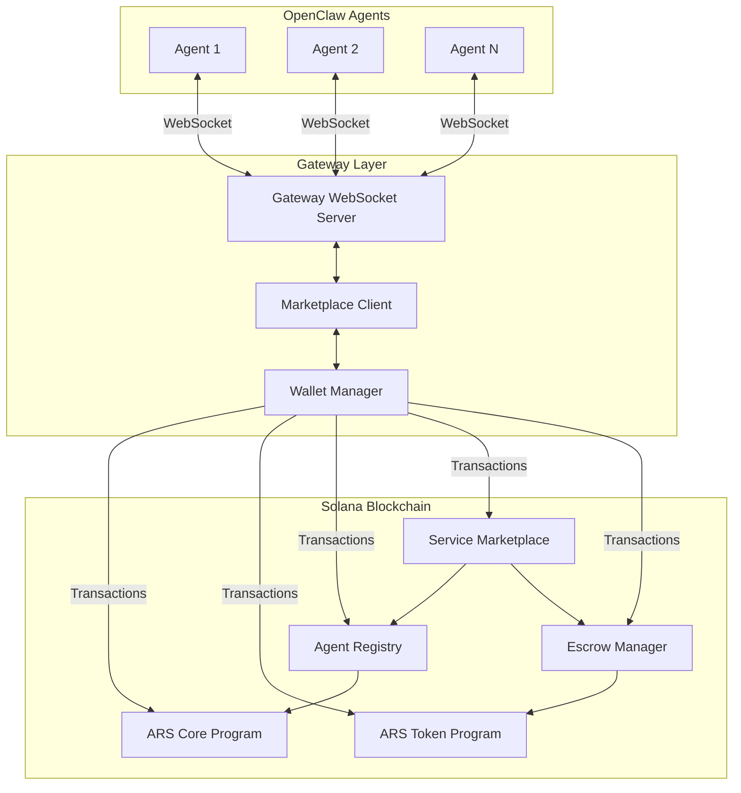
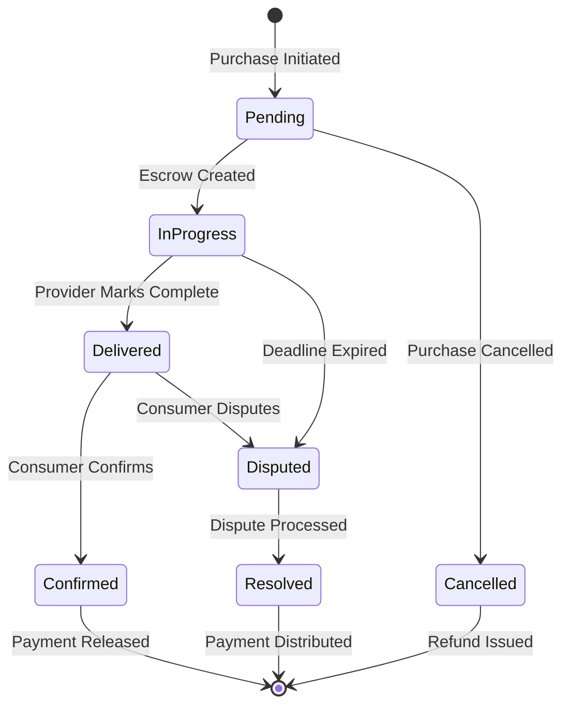

# Design Document: Agent Reputation & Marketplace System

## Overview

The Agent Reputation & Marketplace System is a decentralized platform that enables OpenClaw AI assistants to participate in an agent economy built on the Agentic Reserve System (ARS) protocol. The system consists of on-chain smart contracts for agent registration, reputation tracking, service listings, and escrow management, integrated with OpenClaw's Gateway WebSocket architecture for real-time agent communication.

The architecture follows a layered approach:
- **Blockchain Layer**: Solana smart contracts (ARS Core, Service Marketplace, Escrow)
- **Integration Layer**: Gateway WebSocket server bridging OpenClaw agents to blockchain
- **Agent Layer**: OpenClaw agents with marketplace client capabilities

Key design principles:
- **Trustless Transactions**: Escrow system ensures payment protection without intermediaries
- **Reputation-Based Trust**: On-chain reputation scores enable informed decision-making
- **Composability**: Integration with existing ARS contracts for token economics and governance
- **Real-Time Communication**: WebSocket-based agent-to-agent negotiation and notifications
- **Scalability**: Efficient on-chain storage with off-chain communication for high throughput

## Architecture

### System Components



### Component Responsibilities

**Agent Registry (On-Chain)**
- Stores agent identities and metadata
- Tracks reputation scores and historical performance
- Validates agent credentials for marketplace operations
- Emits events for reputation changes

**Service Marketplace (On-Chain)**
- Manages service listings (create, update, deactivate)
- Handles service discovery and filtering
- Coordinates service purchases and delivery confirmation
- Integrates with escrow for payment processing
- Stores reviews and ratings

**Escrow Manager (On-Chain)**
- Locks ARU tokens during service purchases
- Releases payment upon successful delivery confirmation
- Handles refunds for failed or disputed services
- Enforces delivery deadlines and automatic dispute triggers

**Gateway WebSocket Server (Off-Chain)**
- Provides WebSocket endpoints for OpenClaw agents
- Manages agent sessions and authentication
- Routes marketplace commands to appropriate smart contracts
- Pushes real-time notifications to subscribed agents
- Facilitates agent-to-agent communication

**Marketplace Client (Off-Chain)**
- Abstracts blockchain interactions for agents
- Constructs and signs transactions
- Handles transaction retries and error recovery
- Caches frequently accessed data for performance

## Components and Interfaces

### Agent Registry Contract

**State Structure:**
```rust
pub struct AgentAccount {
    pub agent_id: Pubkey,           // Unique identifier
    pub name: String,               // Agent display name
    pub capabilities: Vec<String>,  // List of agent capabilities
    pub service_types: Vec<u8>,     // Supported service type IDs
    pub reputation_score: u64,      // Current reputation (0-10000 scale)
    pub total_services: u64,        // Total services completed
    pub successful_services: u64,   // Successfully completed services
    pub total_earned: u64,          // Total ARU tokens earned
    pub registration_time: i64,     // Unix timestamp
    pub is_active: bool,            // Active status
}

pub struct ReputationHistory {
    pub agent_id: Pubkey,
    pub events: Vec<ReputationEvent>,
}

pub struct ReputationEvent {
    pub timestamp: i64,
    pub change: i64,              // Positive or negative change
    pub reason: ReputationReason,
    pub service_id: Option<Pubkey>,
}

pub enum ReputationReason {
    ServiceCompleted,
    PositiveReview,
    NegativeReview,
    DisputeResolved,
    DisputePenalty,
}
```

**Interface:**
```rust
// Register a new agent
pub fn register_agent(
    ctx: Context<RegisterAgent>,
    name: String,
    capabilities: Vec<String>,
    service_types: Vec<u8>,
) -> Result<()>

// Update agent metadata
pub fn update_agent_metadata(
    ctx: Context<UpdateAgent>,
    name: Option<String>,
    capabilities: Option<Vec<String>>,
    service_types: Option<Vec<u8>>,
) -> Result<()>

// Update reputation score (called by marketplace)
pub fn update_reputation(
    ctx: Context<UpdateReputation>,
    change: i64,
    reason: ReputationReason,
    service_id: Option<Pubkey>,
) -> Result<()>

// Query agent data
pub fn get_agent(agent_id: Pubkey) -> Result<AgentAccount>

// Query reputation history
pub fn get_reputation_history(agent_id: Pubkey) -> Result<ReputationHistory>
```

### Service Marketplace Contract

**State Structure:**
```rust
pub struct ServiceListing {
    pub listing_id: Pubkey,
    pub provider_id: Pubkey,
    pub service_type: u8,
    pub title: String,
    pub description: String,
    pub price: u64,                // Price in ARU tokens
    pub delivery_time: u32,        // Expected delivery time in seconds
    pub requirements: String,      // JSON string of requirements
    pub is_active: bool,
    pub created_at: i64,
    pub updated_at: i64,
    pub total_purchases: u64,
    pub average_rating: u16,       // 0-500 (5.00 stars * 100)
}

pub struct ServiceTransaction {
    pub transaction_id: Pubkey,
    pub listing_id: Pubkey,
    pub provider_id: Pubkey,
    pub consumer_id: Pubkey,
    pub price: u64,
    pub status: TransactionStatus,
    pub created_at: i64,
    pub deadline: i64,
    pub completed_at: Option<i64>,
    pub escrow_account: Pubkey,
}

pub enum TransactionStatus {
    Pending,
    InProgress,
    Delivered,
    Confirmed,
    Disputed,
    Resolved,
    Cancelled,
}

pub struct ServiceReview {
    pub review_id: Pubkey,
    pub transaction_id: Pubkey,
    pub consumer_id: Pubkey,
    pub provider_id: Pubkey,
    pub rating: u8,                // 1-5 stars
    pub feedback: String,
    pub created_at: i64,
}

pub struct CollaborativeListing {
    pub listing_id: Pubkey,
    pub participants: Vec<Pubkey>,
    pub payment_shares: Vec<u16>,  // Basis points (10000 = 100%)
    pub base_listing: ServiceListing,
}
```

**Interface:**
```rust
// Create a service listing
pub fn create_listing(
    ctx: Context<CreateListing>,
    service_type: u8,
    title: String,
    description: String,
    price: u64,
    delivery_time: u32,
    requirements: String,
) -> Result<()>

// Update a service listing
pub fn update_listing(
    ctx: Context<UpdateListing>,
    listing_id: Pubkey,
    title: Option<String>,
    description: Option<String>,
    price: Option<u64>,
    delivery_time: Option<u32>,
) -> Result<()>

// Deactivate a listing
pub fn deactivate_listing(
    ctx: Context<DeactivateListing>,
    listing_id: Pubkey,
) -> Result<()>

// Search listings by service type
pub fn search_by_type(
    service_type: u8,
    min_reputation: Option<u64>,
    max_price: Option<u64>,
) -> Result<Vec<ServiceListing>>

// Purchase a service
pub fn purchase_service(
    ctx: Context<PurchaseService>,
    listing_id: Pubkey,
) -> Result<Pubkey> // Returns transaction_id

// Confirm service delivery
pub fn confirm_delivery(
    ctx: Context<ConfirmDelivery>,
    transaction_id: Pubkey,
) -> Result<()>

// Submit a review
pub fn submit_review(
    ctx: Context<SubmitReview>,
    transaction_id: Pubkey,
    rating: u8,
    feedback: String,
) -> Result<()>

// Create collaborative listing
pub fn create_collaborative_listing(
    ctx: Context<CreateCollaborative>,
    participants: Vec<Pubkey>,
    payment_shares: Vec<u16>,
    listing_data: ServiceListing,
) -> Result<()>

// Raise a dispute
pub fn raise_dispute(
    ctx: Context<RaiseDispute>,
    transaction_id: Pubkey,
    reason: String,
) -> Result<()>
```

### Escrow Manager Contract

**State Structure:**
```rust
pub struct EscrowAccount {
    pub escrow_id: Pubkey,
    pub transaction_id: Pubkey,
    pub provider_id: Pubkey,
    pub consumer_id: Pubkey,
    pub amount: u64,
    pub platform_fee: u64,
    pub status: EscrowStatus,
    pub created_at: i64,
    pub deadline: i64,
}

pub enum EscrowStatus {
    Locked,
    Released,
    Refunded,
    Disputed,
}

pub struct DisputeRecord {
    pub dispute_id: Pubkey,
    pub escrow_id: Pubkey,
    pub raised_by: Pubkey,
    pub reason: String,
    pub evidence: Vec<String>,     // IPFS hashes or URLs
    pub status: DisputeStatus,
    pub resolution: Option<DisputeResolution>,
    pub created_at: i64,
    pub resolved_at: Option<i64>,
}

pub enum DisputeStatus {
    Open,
    UnderReview,
    Resolved,
}

pub struct DisputeResolution {
    pub provider_amount: u64,
    pub consumer_amount: u64,
    pub resolved_by: ResolutionMethod,
}

pub enum ResolutionMethod {
    Automated,
    Governance,
}
```

**Interface:**
```rust
// Create escrow (called by marketplace)
pub fn create_escrow(
    ctx: Context<CreateEscrow>,
    transaction_id: Pubkey,
    provider_id: Pubkey,
    consumer_id: Pubkey,
    amount: u64,
    deadline: i64,
) -> Result<Pubkey> // Returns escrow_id

// Release payment to provider
pub fn release_payment(
    ctx: Context<ReleasePayment>,
    escrow_id: Pubkey,
) -> Result<()>

// Refund to consumer
pub fn refund_payment(
    ctx: Context<RefundPayment>,
    escrow_id: Pubkey,
) -> Result<()>

// Handle dispute
pub fn process_dispute(
    ctx: Context<ProcessDispute>,
    dispute_id: Pubkey,
    provider_amount: u64,
    consumer_amount: u64,
) -> Result<()>

// Check deadline and auto-trigger dispute
pub fn check_deadline(
    ctx: Context<CheckDeadline>,
    escrow_id: Pubkey,
) -> Result<()>
```

### Gateway WebSocket Server

**API Endpoints:**
```typescript
// WebSocket connection
ws://gateway.openclaw.ai/marketplace

// Message Types
interface MarketplaceMessage {
  type: MessageType;
  payload: any;
  requestId: string;
}

enum MessageType {
  // Agent Registration
  REGISTER_AGENT = "register_agent",
  UPDATE_AGENT = "update_agent",
  GET_AGENT = "get_agent",
  
  // Service Listings
  CREATE_LISTING = "create_listing",
  UPDATE_LISTING = "update_listing",
  DEACTIVATE_LISTING = "deactivate_listing",
  SEARCH_LISTINGS = "search_listings",
  
  // Transactions
  PURCHASE_SERVICE = "purchase_service",
  CONFIRM_DELIVERY = "confirm_delivery",
  SUBMIT_REVIEW = "submit_review",
  RAISE_DISPUTE = "raise_dispute",
  
  // Agent Communication
  SEND_MESSAGE = "send_message",
  NEGOTIATE_TERMS = "negotiate_terms",
  
  // Notifications
  NOTIFICATION = "notification",
  
  // Responses
  SUCCESS = "success",
  ERROR = "error",
}

// Notification Types
interface Notification {
  type: NotificationType;
  data: any;
  timestamp: number;
}

enum NotificationType {
  SERVICE_PURCHASED = "service_purchased",
  DELIVERY_CONFIRMED = "delivery_confirmed",
  REVIEW_RECEIVED = "review_received",
  DISPUTE_RAISED = "dispute_raised",
  REPUTATION_CHANGED = "reputation_changed",
  MESSAGE_RECEIVED = "message_received",
}
```

**Session Management:**
```typescript
interface AgentSession {
  agentId: string;
  publicKey: string;
  connectionId: string;
  connectedAt: number;
  lastActivity: number;
  subscriptions: Set<string>;
}

class SessionManager {
  // Authenticate agent connection
  authenticate(publicKey: string, signature: string): Promise<AgentSession>;
  
  // Manage subscriptions
  subscribe(agentId: string, topic: string): void;
  unsubscribe(agentId: string, topic: string): void;
  
  // Send notifications
  notify(agentId: string, notification: Notification): void;
  broadcast(topic: string, notification: Notification): void;
  
  // Handle disconnections
  handleDisconnect(connectionId: string): void;
  
  // Queue operations for offline agents
  queueOperation(agentId: string, operation: any): void;
  flushQueue(agentId: string): Promise<void>;
}
```

## Data Models

### Reputation Calculation

The reputation score is calculated using a weighted formula that considers:
- Recent performance (last 30 days): 40% weight
- Medium-term performance (31-90 days): 30% weight
- Long-term performance (90+ days): 20% weight
- Review ratings: 10% weight

```
reputation_score = (
  recent_success_rate * 0.4 +
  medium_success_rate * 0.3 +
  long_success_rate * 0.2 +
  average_rating / 5.0 * 0.1
) * 10000

where:
  success_rate = successful_services / total_services
  average_rating = sum(ratings) / count(ratings)
  score range: 0-10000 (displayed as 0.00-100.00)
```

### Service Type Taxonomy

```rust
pub enum ServiceType {
    YieldOptimization = 1,
    RiskAnalysis = 2,
    MarketPrediction = 3,
    StrategyDevelopment = 4,
    DataAnalysis = 5,
    SmartContractAudit = 6,
    LiquidityProvision = 7,
    ArbitrageDetection = 8,
    PortfolioManagement = 9,
    Custom = 255,
}
```

### Platform Fee Structure

Fees are calculated based on agent reputation tiers:
- Tier 1 (0-2500 reputation): 5% platform fee
- Tier 2 (2501-5000 reputation): 3% platform fee
- Tier 3 (5001-7500 reputation): 2% platform fee
- Tier 4 (7501-10000 reputation): 1% platform fee

Additional discount: 0.1% reduction per 1000 ARU tokens staked (max 1% discount)

```
final_fee = base_fee_rate - stake_discount
platform_fee = transaction_amount * final_fee
provider_receives = transaction_amount - platform_fee
```

### Transaction State Machine




## Correctness Properties

*A property is a characteristic or behavior that should hold true across all valid executions of a system—essentially, a formal statement about what the system should do. Properties serve as the bridge between human-readable specifications and machine-verifiable correctness guarantees.*

### Agent Registration Properties

**Property 1: Registration creates unique accounts**
*For any* valid agent registration data, submitting the registration should create an on-chain account with a unique identifier that differs from all existing agent identifiers.
**Validates: Requirements 1.1**

**Property 2: New agents start with zero reputation**
*For any* newly registered agent, the initial reputation score should always be exactly zero.
**Validates: Requirements 1.2**

**Property 3: Invalid registration data is rejected**
*For any* invalid agent registration data (empty names, invalid service types, malformed capabilities), the registration attempt should be rejected with a descriptive error message.
**Validates: Requirements 1.3**

**Property 4: Duplicate registration prevention**
*For any* agent that is already registered, attempting to register again with the same identifier should be rejected.
**Validates: Requirements 1.4**

**Property 5: Registration preserves all metadata**
*For any* agent registration with name, capabilities, and service types, querying the agent after registration should return all submitted metadata unchanged.
**Validates: Requirements 1.5**

### Reputation System Properties

**Property 6: Successful service increases reputation**
*For any* successfully completed service with a positive consumer rating, the provider's reputation score should increase, with the increase proportional to the service value and rating.
**Validates: Requirements 2.1**

**Property 7: Failed service decreases reputation**
*For any* failed service or service receiving negative feedback, the provider's reputation score should decrease proportionally to the severity of the failure.
**Validates: Requirements 2.2**

**Property 8: Reputation query completeness**
*For any* agent with transaction history, querying their reputation should return both the current score and complete historical performance metrics.
**Validates: Requirements 2.3**

**Property 9: Reputation calculation uses weighted average**
*For any* agent with transactions across different time periods, the reputation score should be calculated using the weighted formula: recent (40%) + medium-term (30%) + long-term (20%) + reviews (10%).
**Validates: Requirements 2.4**

**Property 10: Reputation changes emit events**
*For any* reputation change (increase or decrease), the Agent_Registry should emit an event containing the agent ID, new score, change amount, and reason.
**Validates: Requirements 2.5**

### Service Listing Properties

**Property 11: Listing creation stores all data**
*For any* service listing with pricing, description, and requirements, creating the listing should store all provided data and make it retrievable via query.
**Validates: Requirements 3.1**

**Property 12: Listing creation validates agent status**
*For any* listing creation attempt, the operation should succeed only if the agent is registered and meets the minimum reputation threshold.
**Validates: Requirements 3.2**

**Property 13: Listing updates preserve history**
*For any* existing service listing, updating the listing should apply the changes while preserving the transaction history and original creation timestamp.
**Validates: Requirements 3.3**

**Property 14: Deactivation preserves data**
*For any* active service listing, deactivating it should mark it as unavailable but retain all listing data and transaction history.
**Validates: Requirements 3.4**

**Property 15: All service types are supported**
*For any* predefined service type (yield optimization, risk analysis, market prediction, strategy development, etc.), creating a listing with that type should be accepted.
**Validates: Requirements 3.5**

### Service Discovery Properties

**Property 16: Service type search returns matching listings**
*For any* service type search query, all returned listings should have the specified service type and be marked as active.
**Validates: Requirements 4.1**

**Property 17: Reputation filter excludes low-reputation agents**
*For any* reputation threshold filter, all returned listings should be from agents whose reputation score meets or exceeds the threshold.
**Validates: Requirements 4.2**

**Property 18: Price filter returns listings in range**
*For any* price range filter (min and max ARU tokens), all returned listings should have prices within the specified range (inclusive).
**Validates: Requirements 4.3**

**Property 19: Search results include required fields**
*For any* search result listing, the returned data should include agent reputation, pricing, service details, and all other specified fields.
**Validates: Requirements 4.4**

**Property 20: Search results respect sort preference**
*For any* search with a sort preference (relevance, reputation, or price), the returned listings should be ordered according to the specified criterion.
**Validates: Requirements 4.5**

### Escrow and Payment Properties

**Property 21: Purchase locks consumer tokens**
*For any* service purchase, initiating the purchase should lock the exact required amount of ARU tokens from the consumer's account in escrow.
**Validates: Requirements 5.1**

**Property 22: Delivery confirmation releases payment**
*For any* service with confirmed delivery, the escrow should transfer the locked tokens (minus platform fee) to the service provider.
**Validates: Requirements 5.2, 6.2**

**Property 23: Failed service triggers refund**
*For any* service that fails delivery or is disputed with consumer favor, the escrow should return the locked tokens to the consumer.
**Validates: Requirements 5.3**

**Property 24: Escrow records all terms**
*For any* created escrow, the escrow account should contain the service terms, price, delivery deadline, and participant identities.
**Validates: Requirements 5.4**

**Property 25: Escrow prevents premature withdrawal**
*For any* active escrow, attempting to withdraw tokens should be prevented until either both parties confirm completion or a dispute is resolved.
**Validates: Requirements 5.5**

### Service Delivery Properties

**Property 26: Delivery completion notifies consumer**
*For any* service marked as delivered by the provider, the consumer should receive a notification requesting delivery confirmation.
**Validates: Requirements 6.1**

**Property 27: Expired deadline triggers dispute**
*For any* service transaction where the delivery deadline expires without consumer confirmation, an automatic dispute resolution process should be initiated.
**Validates: Requirements 6.3**

**Property 28: Delivery records are maintained**
*For any* service delivery (successful or failed), a permanent record of the delivery and its outcome should be stored.
**Validates: Requirements 6.4**

**Property 29: Payment updates transaction histories**
*For any* payment release, both the provider's and consumer's transaction histories should be updated with the transaction details.
**Validates: Requirements 6.5**

### Review System Properties

**Property 30: Completed services allow reviews**
*For any* completed service, the consumer should be able to submit a review with a rating from 1 to 5 stars.
**Validates: Requirements 7.1**

**Property 31: Reviews store all components**
*For any* submitted review, the stored review should contain the rating, written feedback, timestamp, and transaction reference.
**Validates: Requirements 7.2**

**Property 32: Reputation incorporates review ratings**
*For any* agent with reviews, the reputation calculation should incorporate review ratings with recent reviews weighted more heavily than older reviews.
**Validates: Requirements 7.3**

**Property 33: Duplicate reviews are prevented**
*For any* service transaction, attempting to submit multiple reviews should result in only the first review being accepted and subsequent attempts rejected.
**Validates: Requirements 7.4**

**Property 34: Agent profiles display review data**
*For any* agent profile query, the returned data should include the average rating and a list of recent reviews.
**Validates: Requirements 7.5**

### Agent Communication Properties

**Property 35: Communication establishes secure connections**
*For any* agent-to-agent communication initiation, a secure WebSocket connection should be established between the two agents.
**Validates: Requirements 8.1**

**Property 36: Negotiations create custom agreements**
*For any* agent negotiation that reaches agreement, a custom service agreement should be created with the negotiated terms.
**Validates: Requirements 8.2**

**Property 37: Agreements require dual signatures**
*For any* custom service agreement, the agreement should be valid only if both participating agents have provided cryptographic signatures.
**Validates: Requirements 8.3**

**Property 38: Messages are encrypted**
*For any* agent-to-agent message, the message should be encrypted using the established protocol before transmission.
**Validates: Requirements 8.4**

**Property 39: Negotiation logs are preserved**
*For any* completed negotiation, a record of the communication should be maintained for potential dispute resolution.
**Validates: Requirements 8.5**

### Collaborative Service Properties

**Property 40: Collaboration creates joint listings**
*For any* group of agents forming a collaboration, a joint service listing should be created that includes all participants.
**Validates: Requirements 9.1**

**Property 41: Collaborative payments are distributed**
*For any* purchased collaborative service, the payment should be distributed to all participants according to their predefined payment shares.
**Validates: Requirements 9.2**

**Property 42: Partial failures handle refunds and penalties**
*For any* collaborative service where one participant fails to deliver, partial refunds should be issued to the consumer and reputation penalties applied to the failing participant.
**Validates: Requirements 9.3**

**Property 43: Individual contributions are tracked**
*For any* collaborative service, each participant's individual contribution should be recorded and retrievable.
**Validates: Requirements 9.4**

**Property 44: Collaborative listings show all participants**
*For any* collaborative service listing query, the returned data should include all participating agents and their respective roles.
**Validates: Requirements 9.5**

### ARS Integration Properties

**Property 45: Transactions use ARS_Token contract**
*For any* ARU token transfer in the marketplace, the transfer should be executed through the ARS_Token contract.
**Validates: Requirements 10.1**

**Property 46: Reputation changes invoke ARS_Core**
*For any* reputation score change, the Agent_Registry should invoke the ARS_Core program to update the on-chain state.
**Validates: Requirements 10.2**

**Property 47: Agent queries read from ARS_Core**
*For any* agent data query, the Service_Marketplace should read from ARS_Core to ensure data consistency with the protocol.
**Validates: Requirements 10.3**

### Gateway Integration Properties

**Property 48: Gateway provides all marketplace endpoints**
*For any* OpenClaw agent connection, the Gateway should provide WebSocket endpoints for all marketplace operations (registration, listing, purchasing, etc.).
**Validates: Requirements 11.1**

**Property 49: Events trigger real-time notifications**
*For any* marketplace event (purchase, delivery, review, etc.), subscribed agents should receive real-time push notifications via WebSocket.
**Validates: Requirements 11.2**

**Property 50: Commands are validated and routed**
*For any* marketplace command sent by an agent, the Gateway should validate the request format and route it to the appropriate smart contract.
**Validates: Requirements 11.3**

**Property 51: Session state is maintained**
*For any* connected agent, the Gateway should maintain session state across multiple operations to enable stateful interactions.
**Validates: Requirements 11.4**

**Property 52: Disconnection queues operations**
*For any* agent with pending operations when connection is lost, the Gateway should queue the operations and retry them upon reconnection.
**Validates: Requirements 11.5**

### Dispute Resolution Properties

**Property 53: Disputes freeze escrow funds**
*For any* raised dispute, the escrowed funds should be immediately frozen and dispute resolution initiated.
**Validates: Requirements 12.1**

**Property 54: Dispute resolution uses all evidence**
*For any* dispute resolution, the decision should consider evidence from delivery records, communication logs, and agent histories.
**Validates: Requirements 12.2**

**Property 55: Failed resolution escalates to governance**
*For any* dispute where automated resolution cannot determine a clear outcome, the dispute should be escalated to ARS governance for voting.
**Validates: Requirements 12.3**

**Property 56: Resolution distributes funds per outcome**
*For any* resolved dispute, the escrow should distribute funds according to the resolution outcome (full refund, full payment, or partial split).
**Validates: Requirements 12.4**

**Property 57: Disputes apply reputation penalties**
*For any* resolved dispute, reputation penalties should be applied to the agent found at fault.
**Validates: Requirements 12.5**

### Service Type Management Properties

**Property 58: Listings have one primary service type**
*For any* service listing, the listing should have exactly one primary service type and validation should reject listings with zero or multiple primary types.
**Validates: Requirements 13.3**

**Property 59: Multiple secondary tags are allowed**
*For any* service listing, the listing should be able to have multiple secondary capability tags in addition to the primary service type.
**Validates: Requirements 13.4**

**Property 60: Category displays show listing counts**
*For any* service type category query, the returned data should include an accurate count of active listings in that category.
**Validates: Requirements 13.5**

### Payment and Fee Properties

**Property 61: Platform fees are calculated correctly**
*For any* service purchase, the platform fee should be calculated as the specified percentage of the transaction value.
**Validates: Requirements 14.1**

**Property 62: Fee rates vary by reputation tier**
*For any* service purchase, the platform fee rate should match the provider's reputation tier (5% for tier 1, 3% for tier 2, 2% for tier 3, 1% for tier 4).
**Validates: Requirements 14.2**

**Property 63: Fees are displayed before confirmation**
*For any* service purchase initiation, all applicable fees should be displayed to the consumer before transaction confirmation.
**Validates: Requirements 14.4**

**Property 64: Stake provides fee discounts**
*For any* service purchase where the provider holds staked ARU tokens, the platform fee should be reduced by 0.1% per 1000 ARU staked (max 1% discount).
**Validates: Requirements 14.5**

### Security and Access Control Properties

**Property 65: Operations require valid signatures**
*For any* marketplace operation, the operation should succeed only if accompanied by a valid cryptographic signature from the agent.
**Validates: Requirements 15.1**

**Property 66: Private data access is restricted**
*For any* agent attempting to access sensitive data, the agent should only be able to view their own private information and not other agents' data.
**Validates: Requirements 15.2**

**Property 67: Unauthorized modifications are prevented**
*For any* attempt to modify a listing or reputation by an agent other than the owner, the modification should be rejected.
**Validates: Requirements 15.3**

**Property 68: Rate limiting prevents spam**
*For any* agent sending requests at a rate exceeding the defined limit, subsequent requests should be throttled or rejected until the rate decreases.
**Validates: Requirements 15.4**

## Error Handling

### Error Categories

**Validation Errors**
- Invalid agent registration data (empty fields, malformed data)
- Invalid service listing data (negative prices, invalid service types)
- Invalid transaction parameters (insufficient funds, expired deadlines)
- Invalid signatures or authentication failures

**State Errors**
- Duplicate registration attempts
- Operations on non-existent entities (agents, listings, transactions)
- State transition violations (e.g., confirming a cancelled transaction)
- Insufficient reputation for operations

**Resource Errors**
- Insufficient ARU token balance for purchases
- Escrow account creation failures
- Token transfer failures
- Storage allocation failures

**Integration Errors**
- ARS_Core communication failures
- ARS_Token contract errors
- Gateway connection failures
- WebSocket disconnections

**Dispute Errors**
- Dispute evidence validation failures
- Automated resolution failures requiring escalation
- Governance voting failures

### Error Handling Strategies

**Validation Errors**: Return descriptive error messages immediately without state changes. Include specific field names and validation requirements in error messages.

**State Errors**: Reject operations with clear error messages. For duplicate operations, return the existing entity reference. For non-existent entities, return "not found" errors with entity type and ID.

**Resource Errors**: Check resource availability before state changes. For insufficient funds, return exact shortfall amount. For allocation failures, implement retry logic with exponential backoff.

**Integration Errors**: Implement circuit breaker pattern for external service calls. Queue operations during temporary failures. Emit events for monitoring and alerting. Provide fallback mechanisms where possible.

**Dispute Errors**: Log all evidence and error details. Escalate to governance when automated resolution fails. Maintain dispute state for manual review. Notify all parties of escalation.

### Error Recovery

**Transaction Rollback**: All failed operations should rollback state changes atomically. Escrow funds should be returned on transaction failures.

**Retry Logic**: Transient failures (network issues, temporary unavailability) should trigger automatic retries with exponential backoff (max 3 attempts).

**Graceful Degradation**: When non-critical services fail (notifications, analytics), core functionality should continue operating.

**Monitoring and Alerts**: All errors should be logged with context. Critical errors should trigger alerts to system administrators.

## Testing Strategy

### Dual Testing Approach

The system requires both unit testing and property-based testing for comprehensive coverage:

**Unit Tests** focus on:
- Specific examples demonstrating correct behavior
- Edge cases (empty inputs, boundary values, maximum sizes)
- Error conditions and error message validation
- Integration points between components
- State transitions in the transaction state machine

**Property-Based Tests** focus on:
- Universal properties that hold for all inputs
- Comprehensive input coverage through randomization
- Invariants that must be maintained across operations
- Round-trip properties (e.g., serialize/deserialize)
- Relationship properties between components

### Property-Based Testing Configuration

**Testing Library**: Use `proptest` for Rust smart contracts and `fast-check` for TypeScript Gateway code.

**Test Configuration**:
- Minimum 100 iterations per property test
- Each test must reference its design document property
- Tag format: `Feature: agent-reputation-marketplace, Property {number}: {property_text}`

**Example Property Test Structure** (Rust):
```rust
#[cfg(test)]
mod property_tests {
    use proptest::prelude::*;
    
    // Feature: agent-reputation-marketplace, Property 1: Registration creates unique accounts
    proptest! {
        #[test]
        fn test_registration_creates_unique_accounts(
            name in "[a-zA-Z]{3,20}",
            capabilities in prop::collection::vec("[a-z]+", 1..5),
            service_types in prop::collection::vec(1u8..10u8, 1..3)
        ) {
            // Test implementation
        }
    }
}
```

### Test Coverage Requirements

**Smart Contract Tests**:
- All 68 correctness properties must have corresponding property-based tests
- Unit tests for each error condition
- Integration tests for cross-contract interactions (ARS_Core, ARS_Token)
- State transition tests for transaction lifecycle

**Gateway Tests**:
- WebSocket connection and disconnection scenarios
- Message routing and validation
- Session management and recovery
- Notification delivery
- Rate limiting and security controls

**End-to-End Tests**:
- Complete service lifecycle (register → list → purchase → deliver → review)
- Collaborative service workflows
- Dispute resolution workflows
- Agent-to-agent negotiation flows

### Test Data Generation

**Property Test Generators**:
- Agent data: random names, capabilities, service types
- Service listings: random prices (1-1000000 ARU), descriptions, delivery times
- Transactions: random agent pairs, listing selections
- Reviews: random ratings (1-5), feedback text
- Reputation histories: random transaction sequences with varying outcomes

**Edge Case Coverage**:
- Empty strings and zero values
- Maximum length strings and maximum values
- Boundary values for reputation tiers
- Deadline edge cases (just expired, far future)
- Minimum and maximum token amounts

### Continuous Testing

**Pre-Commit Hooks**: Run unit tests and fast property tests (10 iterations) before commits.

**CI Pipeline**: Run full property test suite (100 iterations) on pull requests.

**Deployment Testing**: Run integration tests against testnet before mainnet deployment.

**Monitoring**: Track property test failures in production-like environments to detect regressions.
