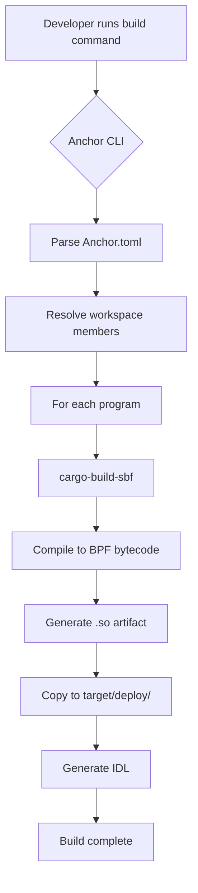

# Design Document: Cargo Build SBF Setup

## Overview

This design establishes a robust build configuration for the ARS Protocol Solana programs using cargo-build-sbf. As of Anchor 0.30.0, cargo-build-sbf is the default and recommended build tool, replacing the deprecated cargo-build-bpf. This configuration will provide direct control over the BPF compilation process while maintaining compatibility with the Anchor framework.

The ARS Protocol workspace contains three programs (ars-core, ars-reserve, ars-token) that need to be compiled to Solana BPF bytecode. The build system will leverage cargo-build-sbf through Anchor's build pipeline, ensuring proper version alignment between Solana CLI (1.18.26), Anchor (0.30.1), and the BPF toolchain.

Key benefits of this approach:
- Direct control over BPF compilation flags and optimizations
- Better compatibility management between toolchain components
- Explicit configuration that documents build requirements
- Improved build reproducibility for deployment verification

## Architecture

### Build Pipeline Flow



### Component Interaction

The build system consists of several interacting components:

1. **Anchor CLI**: Orchestrates the build process, reads configuration, and invokes cargo-build-sbf
2. **cargo-build-sbf**: The Solana-provided tool that compiles Rust programs to BPF bytecode
3. **BPF Toolchain**: The Solana-specific Rust toolchain and LLVM components for BPF compilation
4. **Workspace Configuration**: Cargo.toml files that define dependencies and build profiles
5. **Anchor Configuration**: Anchor.toml that specifies program addresses and build options

### Version Compatibility Matrix

| Component | Version | Compatibility Notes |
|-----------|---------|---------------------|
| Anchor CLI | 0.30.1 | Uses cargo-build-sbf by default |
| Solana CLI | 1.18.26 | Includes cargo-build-sbf |
| anchor-lang | 0.30.1 | Must match Anchor CLI version |
| anchor-spl | 0.30.1 | Must match Anchor CLI version |
| solana-program | 1.18.26 | Must match Solana CLI version |
| Rust toolchain | 1.75+ | Required for solana-program 1.18+ |
| constant_time_eq | 0.3.1 | Pinned for BPF compatibility |

## Components and Interfaces

### Solana CLI Installation

The Solana CLI provides the cargo-build-sbf tool and associated BPF toolchain components.

**Installation Method**:
```bash
sh -c "$(curl -sSfL https://release.solana.com/v1.18.26/install)"
```

**Verification**:
```bash
solana --version  # Should output: solana-cli 1.18.26
cargo-build-sbf --version  # Should output: solana-cargo-build-sbf 1.18.26
```

**Environment Configuration**:
- Add Solana binaries to PATH: `export PATH="$HOME/.local/share/solana/install/active_release/bin:$PATH"`
- Verify cargo can find cargo-build-sbf: `cargo build-sbf --version`

### Anchor.toml Configuration

The Anchor.toml file controls how Anchor invokes the build process. As of Anchor 0.30.0, cargo-build-sbf is the default, but explicit configuration ensures clarity.

**Build Configuration Section**:
```toml
[toolchain]
anchor_version = "0.30.1"

# Anchor 0.30+ uses cargo-build-sbf by default
# No additional configuration needed for default behavior
```

**Program Addresses**:
The existing program addresses remain unchanged:
```toml
[programs.localnet]
ars_core = "ARSFehdYbZhSgoQ2p82cHxPLGKrutXezJbYgDwJJA5My"
ars_reserve = "ARS7PfJZeYAhsYGvR68ccZEpoXWHLYvJ3YbKoG5GHb5o"
ars_token = "ARSM8uCNGUDYCVJPNnoKenBNTzKbJANyJS3KpbUVEmQb"
```

### Workspace Cargo.toml

The workspace Cargo.toml defines shared dependencies and build profiles that apply to all programs.

**Workspace Dependencies**:
```toml
[workspace.dependencies]
anchor-lang = "0.30.1"
anchor-spl = "0.30.1"
solana-program = "1.18.26"
constant_time_eq = "=0.3.1"  # Pinned for BPF compatibility
```

**Build Profiles**:
```toml
[profile.release]
overflow-checks = true  # Required by Anchor 0.30+
lto = "fat"  # Link-time optimization for smaller binaries
codegen-units = 1  # Single codegen unit for better optimization

[profile.release.build-override]
opt-level = 3  # Maximum optimization for build scripts
incremental = false  # Disable incremental compilation for release
codegen-units = 1  # Single codegen unit for build scripts
```

### Program Cargo.toml Files

Each program's Cargo.toml inherits workspace dependencies and defines program-specific configuration.

**Standard Program Configuration**:
```toml
[package]
name = "ars-core"
version = "0.1.0"
edition = "2021"

[lib]
crate-type = ["cdylib", "lib"]
name = "ars_core"

[features]
no-entrypoint = []
no-idl = []
no-log-ix-name = []
cpi = ["no-entrypoint"]
default = []
idl-build = ["anchor-lang/idl-build"]  # Required for IDL generation

[dependencies]
anchor-lang = { workspace = true }
anchor-spl = { workspace = true }
solana-program = { workspace = true }
```

### Build Commands

**Development Build**:
```bash
anchor build
```
- Compiles all programs using cargo-build-sbf
- Generates IDL files
- Outputs .so files to target/deploy/
- Enables debug symbols

**Release Build**:
```bash
anchor build --release
```
- Applies release profile optimizations
- Enables LTO and maximum optimization
- Produces smaller, optimized binaries for deployment

**Build Single Program**:
```bash
anchor build --program-name ars-core
```
- Builds only the specified program
- Useful for faster iteration during development

**Skip IDL Generation**:
```bash
anchor build --no-idl
```
- Skips IDL generation when program API hasn't changed
- Faster builds when only implementation changes

**Clean Build**:
```bash
anchor clean
```
- Removes all build artifacts
- Forces complete rebuild on next build command

### Build Scripts

Create a `scripts/build.sh` for convenient build operations:

```bash
#!/bin/bash
set -e

case "$1" in
  dev)
    echo "Building programs in development mode..."
    anchor build
    ;;
  release)
    echo "Building programs in release mode..."
    anchor build --release
    ;;
  verify)
    echo "Verifying build artifacts..."
    ./scripts/verify-build.sh
    ;;
  clean)
    echo "Cleaning build artifacts..."
    anchor clean
    ;;
  *)
    echo "Usage: $0 {dev|release|verify|clean}"
    exit 1
    ;;
esac
```

Create a `scripts/verify-build.sh` for artifact verification:

```bash
#!/bin/bash
set -e

DEPLOY_DIR="target/deploy"
PROGRAMS=("ars_core" "ars_reserve" "ars_token")

echo "Verifying build artifacts..."

for program in "${PROGRAMS[@]}"; do
  SO_FILE="$DEPLOY_DIR/${program}.so"
  
  if [ ! -f "$SO_FILE" ]; then
    echo "ERROR: $SO_FILE not found"
    exit 1
  fi
  
  SIZE=$(stat -f%z "$SO_FILE" 2>/dev/null || stat -c%s "$SO_FILE" 2>/dev/null)
  echo "✓ $program.so: $SIZE bytes"
  
  # Verify it's a valid ELF file
  if ! file "$SO_FILE" | grep -q "ELF"; then
    echo "ERROR: $SO_FILE is not a valid ELF file"
    exit 1
  fi
done

echo "All build artifacts verified successfully"
```

## Data Models

### Build Configuration

The build configuration is distributed across multiple files:

**Anchor.toml Structure**:
```
[toolchain]
  anchor_version: string

[programs.<cluster>]
  <program_name>: PublicKey (base58 string)

[provider]
  cluster: string
  wallet: path

[test.validator]
  url: string
  clone: array of {address: PublicKey}
```

**Workspace Cargo.toml Structure**:
```
[workspace]
  members: array of paths
  resolver: "2"

[workspace.dependencies]
  <crate_name>: version string or {version, features}

[profile.release]
  overflow-checks: boolean
  lto: "fat" | "thin" | false
  codegen-units: integer
```

### Build Artifacts

**Program Artifact (.so file)**:
- Location: `target/deploy/<program_name>.so`
- Format: ELF shared object compiled to BPF bytecode
- Size limit: ~10MB (Solana program size limit)
- Contains: Compiled program instructions and data

**IDL Artifact (.json file)**:
- Location: `target/idl/<program_name>.json`
- Format: JSON schema describing program interface
- Contains: Instructions, accounts, types, events, errors

**Build Metadata**:
- Location: `target/deploy/<program_name>-keypair.json`
- Format: JSON array of 64 bytes (program keypair)
- Used for: Program deployment and upgrades


## Correctness Properties

A property is a characteristic or behavior that should hold true across all valid executions of a system—essentially, a formal statement about what the system should do. Properties serve as the bridge between human-readable specifications and machine-verifiable correctness guarantees.

### Property 1: Build Artifact Validity

*For any* successful build of the workspace, all program artifacts produced must be valid BPF shared objects within Solana's size limits, and each program defined in the workspace must have a corresponding .so file in the target/deploy directory.

**Validates: Requirements 6.1, 6.2, 6.3**

This property combines three related requirements into a comprehensive validation:
- Every program in the workspace produces a .so artifact
- Every artifact is a valid ELF shared object file
- Every artifact is within Solana's program size limit (~10MB)

## Error Handling

### Build Failures

**Missing Solana CLI**:
- Error: "cargo-build-sbf not found"
- Resolution: Install Solana CLI version 1.18.26 using the installation script
- Verification: Run `cargo build-sbf --version` to confirm installation

**Version Mismatch**:
- Error: "package solana-program v1.18.26 cannot be built because it requires rustc 1.75.0 or newer"
- Resolution: Update Rust toolchain to 1.75 or newer using `rustup update`
- Verification: Run `rustc --version` to confirm Rust version

**Anchor Version Incompatibility**:
- Error: "anchor-lang version mismatch"
- Resolution: Ensure all Anchor crates (anchor-lang, anchor-spl) use version 0.30.1
- Verification: Check workspace Cargo.toml dependencies

**BPF Toolchain Download Failure**:
- Error: "failed to download platform-tools"
- Resolution: Clear cargo cache and retry: `rm -rf ~/.cache/solana/*`
- Verification: Rebuild and monitor download progress

**Program Size Exceeds Limit**:
- Error: "program too large"
- Resolution: Enable LTO and optimize code size in release profile
- Verification: Check .so file size with `ls -lh target/deploy/*.so`

### Configuration Errors

**Invalid Anchor.toml**:
- Error: "failed to parse Anchor.toml"
- Resolution: Validate TOML syntax and required fields
- Verification: Use a TOML validator or check Anchor documentation

**Missing Program in Workspace**:
- Error: "program not found in workspace"
- Resolution: Add program path to workspace.members in root Cargo.toml
- Verification: Run `cargo metadata` to list workspace members

**Incorrect Program ID**:
- Error: "program ID mismatch"
- Resolution: Ensure program ID in Anchor.toml matches the keypair in target/deploy
- Verification: Compare IDs using `solana address -k target/deploy/<program>-keypair.json`

### Runtime Errors

**Insufficient Disk Space**:
- Error: "No space left on device"
- Resolution: Clean build artifacts with `anchor clean` and free disk space
- Verification: Check available space with `df -h`

**Permission Denied**:
- Error: "Permission denied" when writing artifacts
- Resolution: Check file permissions on target directory
- Verification: Ensure user has write access to project directory

**Concurrent Build Conflicts**:
- Error: "Blocking waiting for file lock"
- Resolution: Wait for other build processes to complete or kill stale processes
- Verification: Check for running cargo processes with `ps aux | grep cargo`

## Testing Strategy

### Dual Testing Approach

This feature requires both unit tests and property-based tests to ensure comprehensive coverage:

- **Unit tests**: Verify specific configuration examples, command execution, and error conditions
- **Property tests**: Verify universal properties across all build scenarios

Both testing approaches are complementary and necessary for comprehensive validation.

### Unit Testing

Unit tests will focus on:

1. **Configuration Validation**:
   - Test that Anchor.toml contains correct toolchain version
   - Test that workspace Cargo.toml contains correct dependency versions
   - Test that program Cargo.toml files use workspace dependencies
   - Test that build profiles contain required settings

2. **Command Execution**:
   - Test that `anchor build` command succeeds
   - Test that `anchor build --program-name <name>` builds single program
   - Test that `anchor build --release` applies release optimizations
   - Test that `anchor clean` removes build artifacts

3. **Environment Verification**:
   - Test that Solana CLI is installed and accessible
   - Test that cargo-build-sbf is available in PATH
   - Test that versions match expected values

4. **Error Conditions**:
   - Test behavior when Solana CLI is not installed
   - Test behavior when version mismatches occur
   - Test error messages for common build failures

### Property-Based Testing

Property tests will verify universal correctness properties using a property-based testing library (proptest for Rust or fast-check for TypeScript).

**Configuration**:
- Minimum 100 iterations per property test
- Each test tagged with: **Feature: cargo-build-sbf-setup, Property {number}: {property_text}**

**Property Test 1: Build Artifact Validity**
- **Tag**: Feature: cargo-build-sbf-setup, Property 1: Build Artifact Validity
- **Test**: For any successful build, verify all programs produce valid .so files within size limits
- **Implementation**:
  1. Run `anchor build` for the workspace
  2. For each program in workspace.members:
     - Assert .so file exists in target/deploy/
     - Assert file is valid ELF format (check magic bytes)
     - Assert file size < 10MB (Solana limit)
  3. Repeat for different build configurations (dev, release)

### Integration Testing

Integration tests will verify the complete build workflow:

1. **Fresh Build Test**:
   - Clean all artifacts
   - Run full workspace build
   - Verify all artifacts produced
   - Verify IDL files generated

2. **Incremental Build Test**:
   - Build workspace
   - Modify single program source file
   - Rebuild workspace
   - Verify only modified program rebuilds

3. **Release Build Test**:
   - Build in release mode
   - Verify optimizations applied
   - Verify artifact sizes smaller than dev builds

4. **Build Script Test**:
   - Execute build.sh with different arguments
   - Verify correct build commands invoked
   - Verify verification script validates artifacts

### Test Environment

Tests should run in a clean environment with:
- Solana CLI 1.18.26 installed
- Anchor CLI 0.30.1 installed
- Rust 1.75+ installed
- Fresh clone of the repository

### Continuous Integration

Build tests should run on:
- Pull request creation
- Commits to main branch
- Scheduled daily builds

CI should verify:
- All programs build successfully
- All tests pass
- Build artifacts are valid
- No version conflicts exist
